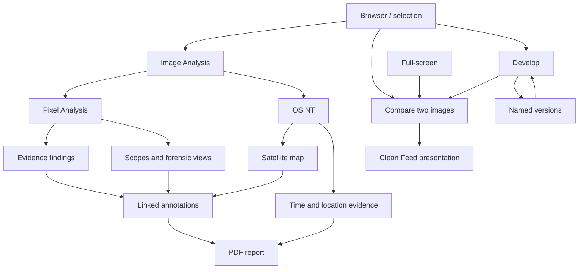
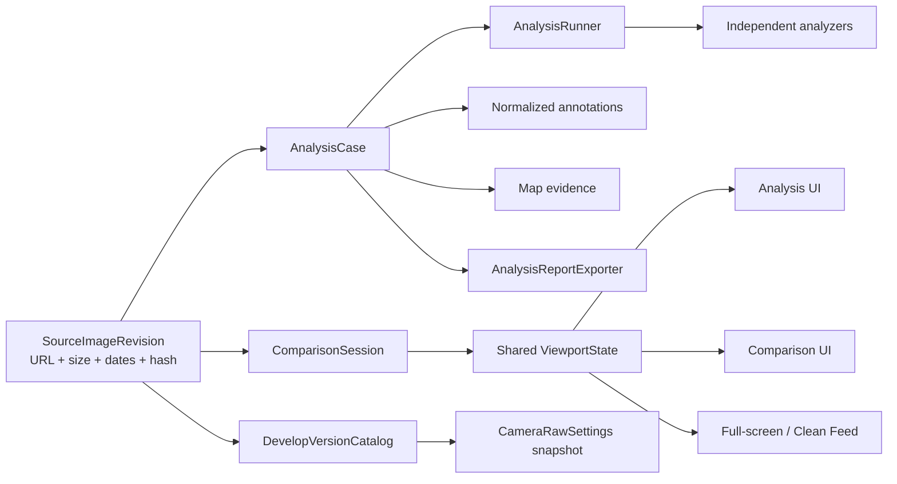

# Aagedal Photo Agent 3.0 — release plan (historical `v2.3` path)

> Project planning index: [../README.md](../README.md)
>
> **Version decision (2026-08-19):** the combined next-release scope is now labelled 3.0. This
> directory keeps its historical `v2.3` path so existing links and implementation history remain
> stable.

**Status:** implementation in progress

**Plan date:** 2026-07-26

**Target platform:** macOS 26, Apple Silicon

**Implementation status:** Phases 1 and 2 complete; Phase 3 automated validation is complete with
shared fit/true-pixel hover geometry, orientation/crop-aware source-pixel inspection, generalized
scope rendering, resizable one/two/four-up scopes, selected-region scope input, linear-light RGB
channel/relative-luminance views, calibrated compression residuals, and cost-bounded, cancellable
derived-view rendering integrated into Image Analysis; automated HDR/SDR, alpha, orientation, crop,
and malformed-source validation is complete, while fixture-corpus visual validation remains open.
Analysis cases and the working-folder map now prefer portable `.photo_analysis` storage, fall back
to an indexed local Application Support store only when the photo folder is read-only, and show a
portability warning while fallback storage is active.
Phase 4 has started with normalized, source-bound annotation persistence and schema migrations for
line, arrow, distance, rectangle, ellipse, and label markup, plus a bounded photo-surface undo/redo
history with persistent transactions and standard keyboard shortcuts. Source-pixel distance labels
now resolve through the original-image transform across orientations and Developed crops. The case
sidebar exposes an ordered, keyboard-selectable layer list with per-annotation and grouped
visibility controls.
Distance annotations can now define a single real-world calibration in millimeters, centimeters,
meters, inches, or feet; all source-pixel measurements then show the converted value alongside
their reproducible pixel length, with calibration changes included in photo-surface undo/redo.
Findings and photo annotations can now be linked many-to-many from finding detail; persistent links
participate in annotation undo/redo, show counts in both sidebar lists, and focus linked markup.
The Select tool now moves all annotation kinds and resizes segment, rectangle, and ellipse markup
from visible handles, committing each completed drag as one undoable source-frame edit.
Phase 5 has started with a persisted, source-bound timestamp evidence model and an OSINT timeline.
Embedded capture, GPS, file-system, sidecar, and user-entered evidence retain their source and
precision, while timezone-less wall-clock values remain explicitly unresolved rather than being
coerced to UTC. Only timezone-qualified timestamps participate in absolute chronology checks; the
timeline highlights those conflicts and supports case-only user observations without IPTC writes.
The OSINT map now distinguishes embedded GPS from an investigator location, supports persisted
satellite/hybrid viewports, shared DD/DMS/DDM entry, MapKit place search, and configured
online/offline reverse geocoding. Investigator coordinates, place-name provenance, and viewport
state remain in the analysis JSON and never enter the IPTC/XMP write path. The photo-markup toolbar
now exposes its fixed palette as a direct swatch row, expanded with red, green, and cyan alongside
the existing colors and custom color well.
Map markup now adds persistent markers, lines, polygons, geodesic distance segments, and labels
from an accessible map-center workflow. Map layers have independent visibility and undo/redo, and
can reference any photo-annotation UUID so cross-surface links survive label edits without copying
text. OSINT now separates Photo and Map tools in its fixed markup bar, gives the map a full-height
column, and provides a working-folder thumbnail rail plus per-photo/folder layer scope. Selected
photo objects can be placed at the map center in one click with the same color. Every annotation
kind can be labeled, photo annotations can carry longer notes, and the lower pane exposes photo
and map annotations side by side. Setting the photo location preserves the investigator's zoom and
can optionally add a persisted bearing/angle/range field-of-view cone. Map authoring actions now
share the fixed markup row to preserve map height, and
investigators can add expandable case-only notes when no timestamp can be established.
The Working Folder scope now owns a separate shared map document alongside the source-bound image
cases. A shared marker can reference any number of photo annotations through stable case-ID and
annotation-ID pairs, so the same landmark can be identified in several images without duplicating
its geographic markup. This Photo continues to author image-local map layers independently.
The map now reports offline connectivity, failed MapKit requests, and unavailable satellite imagery
as distinct non-destructive states. A cancellable visible-region probe supplies a retryable imagery
status, place autocomplete no longer drops errors silently, and coordinate entry plus saved map
evidence remain usable when online services are unavailable.
Phase 5 report evidence is now frozen as exact WGS-84 viewport and visible geographic markup for an
app-rendered schematic; exported reports will not persist or redistribute Apple map tiles. The
immutable Phase 6 report snapshot re-hashes the current source before capture, orders report inputs
deterministically, filters excluded findings, and includes a live Apple Maps viewport reference.
Phase 6 now has a workspace PDF export path for A4 and US Letter. It renders cover, source revision,
findings, annotation legend, timeline, untimed observations, a WGS-84 map schematic, methodology,
limitations, analyzer provenance, and raw metadata from the immutable snapshot. Export settings make
paths, serial numbers, exact coordinates, live map links, and raw metadata selectable and warn before
sharing sensitive fields. Rendering reports progress between closed pages, honors cancellation,
revalidates the source hash, and atomically replaces only the selected destination. Structural tests
and full-page raster review cover both paper sizes. Reports now include an aspect-preserving annotated
source overview plus an optional selected evidence crop taken directly from the original source pixels.
The snapshot freezes display-oriented and source-storage pixel bounds, and the report states that the
crop uses 1:1 source-pixel extraction with no interpolation. Stress coverage includes long findings,
Unicode, missing figures, many annotations, and organically flowing multi-page content.
The broad conditional sun/shadow analyzer is not approved for 3.0 because terrain, clock/timezone,
and measurement uncertainty have not yet passed an evidence-quality gate. The separately planned
solar-position direction overlay stays within the narrower approved boundary. Its OSINT controls
now accept only an explicit Photo Location and timezone-qualified minute-or-better timestamp,
including eligible timeline evidence or a fixed-offset manual civil time. The popover previews
solar/event values and preserves per-ray visibility without consulting the Mac's current timezone;
Apple Maps and OpenStreetMap now render the same viewport-scaled, true-north direction rays without
adding them to evidence annotations or undo history. Immutable schema-4 report snapshots now freeze
validated solar inputs, outputs, method, and provenance, and the PDF uses the shared ray geometry
with a calculation table, methodology, and explicit limitations. Manual map-camera, style-switch,
accessibility, and live-versus-report validation remains before release; the arm64 automated run
covers the product's Apple-Silicon-only architecture support.
Phase 7 now includes the reusable comparison session/coordinator and a Browser workspace for exactly
two selected images. Side-by-side, stacked, and angled-wipe layouts share synchronized fit, true-pixel, and
custom viewport state with deliberate alignment offsets. The focused pane can be replaced in visible
filmstrip order, confirmed deletion preserves the surviving pane and offers a nearby replacement,
and leaving Compare restores the current comparison selection to the Browser. Pane badges explicitly
identify Original, Committed Edit, Live Edit, or a named version. Comparison output is capped at a
4096-pixel long edge, and RAW decodes share a cancellation-aware single-permit gate so two large RAW
sources cannot create overlapping transient decode spikes. The difference layout remains deferred
and do not block 3.0.
Phase 8 now includes Develop comparison entry. The inspector can compare the current image with the
previous supported filmstrip image by default, or with a target chosen from a filmstrip context
menu, without changing the active edit selection. The current pane is a debounced, revision-bound
Live Edit rendered through the same Metal graph as Develop; the target pane retains its committed
representation. The shared comparison coordinator continues to own layout, focus, pan/zoom lock,
and alignment semantics while the Develop inspector remains editable. Live output remains bounded
to the comparison memory budget, reuses the captured source revision after the first render, and
reports render failure rather than mislabeling unedited fallback pixels as live evidence.

The 3.0 investigation and review workstream adds three connected
capabilities:

1. an **Image Analysis** workspace for pixel forensics and OSINT-oriented review;
2. a reusable **Comparison** experience for two images with synchronized navigation;
3. **named Develop versions**, stored privately as JSON rather than multiplying XMP
   representations.

This directory converts the short backlog in `TODO.md` into an implementation-ready
release plan and tracks progress as the application code is built.

## Product intent

3.0 should help a photographer, editor, or investigator answer three different questions:

- **What does the file itself support?** Inspect pixels, compression, metadata, provenance,
  and internally inconsistent signals.
- **How do these two images differ?** Compare framing, detail, edits, and compression at the
  same location and scale.
- **Which interpretation of this image should I keep?** Save and revisit named grading
  alternatives without duplicating source files.

The app must separate observations from conclusions. Image analysis can surface evidence
and explain why it matters, but must not claim that an image is authentic, manipulated, or
AI-generated when the evidence cannot establish that.

## Release principles

### Evidence, not verdicts

Analysis results use the terms **observation**, **warning**, and **limitation**. They do not
use a single “real/fake” score. Every automated finding records:

- what was observed;
- which analyzer produced it and its version;
- the source data used;
- a plain-language explanation;
- confidence in that narrow observation;
- known alternative explanations;
- whether the result can be reproduced from the unchanged source.

### Non-destructive by default

- Opening or running analysis never edits the source image or its metadata.
- Analysis cases and named Develop versions are app-private JSON.
- Report export produces a new PDF.
- Existing XMP behavior remains the compatibility path for the primary Develop state.
- A named JSON version is not written into XMP unless the user explicitly promotes it to
  the primary edit.

### Source integrity

Analysis is always tied to a specific source revision. A case records a strong source hash
when analysis starts and re-checks it before reopening or exporting a report. If the bytes
changed, the old results remain readable but are visibly marked **source changed** and are
not silently applied to the new revision.

### Shared interaction model

Image Analysis, Comparison, full-screen, Develop, and Clean Feed should share:

- normalized display-oriented coordinates;
- the same zoom limits and scaling choices where practical;
- one definition of “fit,” 100%, and synchronized pan;
- the same edited/original rendering rules;
- keyboard focus that belongs to the visible window.

## Scope

### Must ship in 3.0

- A first-class Image Analysis entry in the main layout selector.
- Pixel Analysis and OSINT modes within the analysis workspace.
- Source facts, metadata/provenance inspection, suspicious metadata rules, and
  human-readable explanations.
- At least one useful compression/residual visualization beside the normal image.
- Larger existing scopes with hover inspection.
- Normalized photo markup: line, distance, rectangle, ellipse, label, and color.
- Pixel measurements and optional real-world calibration.
- Satellite/hybrid map companion with linked colored labels and map markup.
- Analysis case persistence with source-revision validation.
- Analysis report PDF containing findings, evidence images, annotations, methodology,
  limitations, source hash, and map attribution when applicable.
- Two-image Comparison with synchronized zoom and pan, temporary unlock/offset, reset, and
  a clear alignment status.
- Comparison entry from Browser, Develop, and full-screen; a comparison presentation option
  for Clean Feed.
- Named Develop versions in an app-private version store, including create, rename,
  duplicate, switch, delete, and promote-to-primary.
- Backward-compatible storage and recovery behavior.
- Unit, rendering, persistence, performance, accessibility, and manual validation gates.

### Conditional scope

The following items ship only if their research gates pass:

- an on-device AI-origin detector;
- automatic highlight regions for “common AI artifacts”;
- automatic clone/copy-move detection;
- sun/shadow time consistency;
- an online imagery or place-search provider beyond MapKit;
- report signing or C2PA attachment.

Conditional work must not delay the evidence workspace, comparison, or versioning core.

### Explicitly out of scope

- A legally dispositive authenticity verdict.
- Face recognition against public or third-party databases.
- Reverse-image search scraping.
- Cloud upload of source pixels without a separate, explicit product decision.
- Silent metadata correction based on analysis.
- Writing the complete named-version catalog to XMP.
- Pixel-to-centimeter conversion inferred from DPI metadata alone.
- A general vector illustration editor.
- Collaborative cases, shared annotations, or multi-user merge in 3.0.

## Proposed user journeys

### Analyze one image

1. Select an image and choose **Image Analysis**.
2. The app creates or reopens a case tied to the current source hash.
3. Fast local analyzers produce source facts and metadata/provenance findings.
4. The user selects Pixel Analysis or OSINT.
5. Expensive analyzers run on demand and can be cancelled.
6. The user inspects scopes, compression views, and finding details; adds annotations.
7. The user optionally places the image on a satellite map and links matching labels.
8. The user exports a reproducible PDF report.

### Compare two images

1. Select exactly two images and choose **Compare**.
2. Both images start fit-to-view with synchronization enabled.
3. Zooming or panning either pane moves the other to the corresponding normalized position.
4. The user temporarily unlocks a pane to establish an alignment offset, then re-locks.
5. The same session can be opened in full-screen or sent to Clean Feed.
6. Leaving comparison returns selection and navigation to the previous workspace.

### Keep alternate grades

1. In Develop, choose **New Version from Current**.
2. Name the version and continue editing.
3. Switch among versions without overwriting the other snapshots.
4. The primary/XMP-backed edit remains identifiable.
5. Choose **Promote to Primary** to deliberately replace the current primary Develop state
   and write through the existing XMP save path.

## Product information architecture

## Architecture direction

Do not add all 3.0 state directly to `ContentView`. Introduce bounded feature models and
services, with `ContentView` responsible only for navigation and shared dependencies.

### Shared foundations

The first implementation phase should establish:

- `SourceImageRevision`: canonical file URL, resource identifier when available, byte size,
  modification date, and SHA-256;
- `DisplayImageTransform`: sensor orientation, displayed pixel size, crop/rotation context,
  and normalized point/rect transforms;
- `ViewportState`: scale, center, fit mode, interpolation, and optional synchronization
  offset;
- atomic, versioned JSON persistence with backup-before-replace;
- explicit schema migrations and unknown-field tolerance.

The names above describe responsibilities, not mandatory Swift type names.

## Existing components to reuse

| Existing component | Reuse in 3.0 | Constraint |
|---|---|---|
| `MainViewMode` and layout menu | Add Image Analysis navigation | Keep mode-specific toolbars out of one giant branch |
| `FullScreenImageCache` | Oriented/edited source loading | Analysis needs an explicit original-vs-developed policy |
| `ScopeViewModel`, `MetalScopePipeline`, `ScopeRenderService` | Existing four scopes | Generalize output sizing and hover sampling |
| Advanced Export comparison/loupe | Coordinate math, true-pixel crop ideas | Extract reusable behavior; do not couple analysis to export formats |
| `TechnicalMetadata` and metadata read services | Source facts and metadata observations | Analysis needs raw-value provenance, not display strings alone |
| C2PA validation services | Credential state and manifest detail | Report trusted/valid/invalid separately |
| `GPSSectionView` and `GeocodingService` | MapKit patterns and coordinate formatting | Analysis map state is evidence, not IPTC editing |
| `RosterPDFExporter` | Core Graphics PDF precedent | Analysis requires pagination, evidence figures, and accessibility metadata |
| `CameraRawSettings` | Version snapshot payload | Strip render-time/transient fields and preserve unknown corrections safely |
| Clean Feed controller/window | Secondary-display lifecycle | Comparison needs a new two-source presentation contract |

## Workstreams

| ID | Workstream | Primary output | Depends on |
|---|---|---|---|
| F0 | Research and fixtures | Decision records, reference corpus, licensing answer | none |
| F1 | Shared source and viewport foundation | Identity, transforms, persistence, sync model | F0 |
| A1 | Analysis case and workspace shell | Navigation, case lifecycle, mode switch | F1 |
| A2 | Metadata/provenance analyzers | Findings with explanations | A1 |
| A3 | Pixel views and analyzer runner | Compression/residual views, large scopes | A1 |
| A4 | Markup and measurement | Photo/map annotations, calibration | A1, F1 |
| A5 | OSINT map and timeline | Map placement and time/location evidence | A1, A4 |
| A6 | PDF report | Reproducible export | A2–A5 |
| C1 | Comparison core | Two-source session and synchronized viewport | F1 |
| C2 | Comparison integrations | Browser, Develop, full-screen, Clean Feed | C1 |
| V1 | Version storage | Catalog, migration, atomic writes | F1 |
| V2 | Version workflow | Develop UI, dirty state, promotion | V1 |
| R1 | Release hardening | Performance, accessibility, docs, regression | all shipping tracks |

Detailed sequencing and gates are in [delivery-plan.md](delivery-plan.md).

## Release gates

3.0 is release-ready only when all of the following are true:

1. Existing XMP edits open and save without semantic change.
2. Analysis and version JSON survive interruption and a failed write without losing the
   previous valid record.
3. A changed source file cannot silently inherit stale findings or annotations.
4. Every automated finding exposes its basis and limitations.
5. Comparison sync stays stable across different aspect ratios, orientations, crops, and
   edited/original display choices.
6. Switching versions cannot silently overwrite the previous dirty version.
7. Report figures match the on-screen source revision and include required attribution.
8. Full-screen and Clean Feed continue to transfer focus and tear down cleanly.
9. Large RAW and HDR inputs remain cancellable and stay within agreed memory limits.
10. VoiceOver, keyboard-only use, reduced motion, contrast, and minimum window size have
    documented manual passes.

## Decisions made by this plan

- Analysis results are persisted separately from IPTC JSON sidecars, XMP, and face data.
- The UI reports individual evidence, not an aggregate authenticity score.
- Analysis is original-source-first; a developed rendering can be inspected as a clearly
  labeled secondary representation.
- Measurements are pixels until the user supplies a calibration.
- Comparison synchronization uses normalized displayed-image coordinates and supports a
  user-defined offset.
- Named Develop versions are app-private JSON snapshots. The existing primary edit remains
  the XMP interoperability surface.
- Online or model-backed analyzers are opt-in additions, not requirements for the core
  analysis workspace.

## Open product decisions

These decisions should be resolved during F0 before their dependent phase begins:

1. **Resolved:** analysis cases live beside the image in `.photo_analysis` by default. Read-only
   photo folders use an indexed Application Support fallback and show a portability warning; the
   fallback is local-only and does not silently enter portable settings sync.
2. Should the report embed the full source image, a bounded preview, or only annotated crops?
   The recommendation is a bounded preview plus user-selected evidence crops.
3. Should satellite imagery be limited to MapKit, and can snapshots be redistributed inside
   exported reports under the applicable terms and attribution rules?
4. What calibrated model and corpus, if any, justify shipping AI-origin scoring?
5. Should a version switch auto-save the current named version, prompt, or keep an in-memory
   dirty buffer? The recommendation is auto-save to the version JSON after explicit version
   creation, with visible dirty/error state and undo remaining session-local.
6. Does Clean Feed show side-by-side, wipe, or the currently focused comparison pane by
   default? The recommendation is side-by-side with a View-menu choice.

## Plan documents

- [image-analysis.md](image-analysis.md) — analysis workspace, evidence model, pixel tools,
  OSINT, markup, maps, and reporting.
- [comparison-and-versions.md](comparison-and-versions.md) — synchronized comparison and
  named Develop versions.
- [storage-and-architecture.md](storage-and-architecture.md) — proposed schemas, ownership,
  transforms, migration, security, and recovery.
- [delivery-plan.md](delivery-plan.md) — phases, task breakdown, test strategy, risks, and
  release checklist.
- [wireframes.md](wireframes.md) — low-fidelity layouts and interaction states.

## Change-control rule

As implementation begins, update the checklists in `delivery-plan.md` and record material
scope or architecture changes in a dated decision log at the bottom of this file. Do not
silently redefine forensic claims or persistence behavior in code.

## Decision log

| Date | Decision | Reason |
|---|---|---|
| 2026-07-26 | Establish evidence-first analysis with no real/fake score | The requested evidence is useful; a universal verdict is not supportable |
| 2026-07-26 | Share source identity and viewport foundations across all three tracks | Prevent divergent orientation, crop, and stale-file behavior |
| 2026-07-26 | Keep named versions in JSON and retain one explicit primary XMP state | Meets app-private versioning goal while preserving interoperability |
| 2026-07-26 | Persist source SHA-256 as lowercase hex and treat filesystem identifiers as opaque discovery hints | Keeps exact byte identity portable while still supporting fast rename/move discovery |
| 2026-07-30 | Use a fixed ImageIO JPEG 0.90 re-encode with a 12× linear-sRGB absolute difference for the baseline compression residual | Makes the view reproducible and labelable while avoiding any unsupported manipulation verdict; Analysis uses a bounded 2,048-pixel preview and composites alpha over 50% gray |
| 2026-08-02 | Use one shared OSINT markup bar and treat annotation labels as optional identity on every geometry | Keeps authoring consistent across photo/map surfaces and lets non-text photo evidence participate in stable map links |
| 2026-08-02 | Store untimed investigator notes separately from timestamp evidence | Avoids fabricating a date while retaining case-only observations in report inputs |
| 2026-08-23 | Prefer folder-local analysis persistence with an indexed Application Support fallback for read-only photo folders | Keeps cases portable when possible without making the investigation workspace unusable or repeatedly requesting access when the folder cannot be written |
