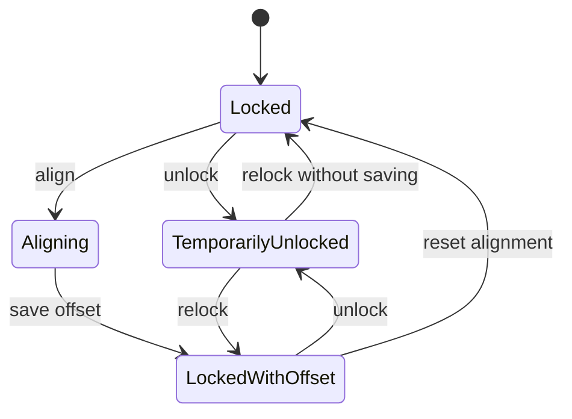

# Version 2.3 — Comparison and Develop versions

## Part I: two-image Comparison

### Goal

Let the user inspect two images side by side, keeping the same visual location and scale in
view while still allowing deliberate offset. The comparison behavior should be reusable from
Browser, Develop, full-screen, and Clean Feed instead of being four unrelated implementations.

### Entry rules

| Entry point | Default left image | Default right image | Representation |
|---|---|---|---|
| Browser | First image in visible selection order | Second image | Committed display state |
| Develop | Current image | User-selected comparison image or previous filmstrip image | Live current edit vs committed comparison |
| Full-screen | Current image | Second selected image or chosen neighbor | Current full-screen display state |
| Clean Feed | Active `ComparisonSession` | Same session | User-selected layout |

- Browser Compare is enabled for exactly two supported selected images.
- Develop Compare can open a picker/filmstrip action if no comparison target exists.
- Full-screen must dismiss or transition its dedicated window safely, following the existing
  focus-transfer rule used when opening Develop.
- If one source disappears, keep the surviving pane, show a clear missing-source state, and
  offer replacement or exit.

### Layouts

Must ship:

- side by side;
- stacked;
- adjustable angled wipe overlay;
- adjustable divider.

Strong stretch:

- difference blend.

Difference blend should not block 2.3 because meaningful alignment requires more than synchronized
viewport coordinates.

### Shared viewport semantics

Synchronization must be defined mathematically:

- each pane has a displayed-image rect after orientation and any chosen developed crop;
- viewport center is normalized in that displayed rect;
- zoom is expressed as source/display pixel scale, not SwiftUI view scale;
- sync copies normalized center and comparable pixel scale;
- each pane clamps independently at its edges;
- clamping one pane must not cause feedback oscillation in the other;
- different aspect ratios can show different edge coverage while sharing the same center;
- the UI indicates when exact lock is impossible because one pane is clamped.

### Lock and offset

The comparison session has:

- **Locked** — pan and zoom are synchronized.
- **Unlocked** — each pane moves independently.
- **Align/offset mode** — one pane is the anchor; moving the other records a normalized center
  offset and optional scale ratio.
- **Re-locked with offset** — later movement preserves the established relationship.
- **Reset alignment** — clears offset and returns to equal normalized center/scale.

Do not overload “unlock” with “forget alignment.” Users need to inspect one pane temporarily
without losing a carefully established offset.

### Rendering policy

- Show a badge for **Original**, **Committed Edit**, **Live Edit**, or named version.
- Preserve each source’s HDR state but warn when the two panes use materially different display
  modes.
- A comparison scale selector offers Fit, 100%, and linked custom zoom.
- At 100%, use one source pixel per backing pixel when possible and disclose any display scaling.
- Interpolation choice is shared by default.
- Render requests are cancellable, deduplicated, and bounded through existing cache/decode gates.
- Live Develop comparison should mirror the edit pipeline rather than continuously exporting.

### Navigation and selection

- Arrow keys can replace the focused pane from the filmstrip without closing Compare.
- Tab changes focused pane.
- `L` toggles lock only if it does not conflict with established app shortcuts; confirm during F0.
- `R` or a toolbar action resets alignment.
- Escape exits Compare and restores the originating workspace and focus.
- Ratings/labels apply to the focused image, with visible focus affordance.
- Delete remains confirmation-based and handles the surviving pane.

Keyboard choices belong in the keyboard-shortcuts settings/help surface before release.

### Clean Feed

Extend the Clean Feed content contract from one current image to a presentation:

- single focused pane;
- side by side;
- stacked;
- adjustable wipe position and angle.

Clean Feed is presentation-only. Alignment and source replacement remain controlled from the main
window. The secondary display follows changes without becoming key. If GPU mirroring two live
Develop sources is too expensive, allow one live source plus one cached committed rendering and
label the state.

### Architecture

Proposed responsibilities:

- `ComparisonSession`: two `ComparisonSource` values, origin workspace, layout, focus, lock state,
  offset, scale ratio, and representation labels.
- `ComparisonSource`: source revision plus original/committed/live/named-version representation.
- `ViewportState`: reusable pan/zoom state.
- `ComparisonCoordinator`: one-way update transactions that prevent feedback loops and apply
  clamping/offset.
- `ComparisonRenderService`: resolves a source representation to an oriented image/texture and
  render token.
- `ComparisonView`: layout and controls only.

Extract applicable true-pixel crop and normalized hover math from Advanced Export into reusable
utilities. Advanced Export should continue behaving identically after extraction.

### Comparison tests

- normalized center and scale synchronization;
- aspect-ratio mismatch and independent edge clamp;
- all EXIF orientations;
- crop/no-crop and rotated crop combinations;
- alignment offset save/reset;
- no feedback loop after alternating pane updates;
- source deletion/replacement;
- live edit token invalidation;
- HDR/SDR state labeling;
- full-screen focus transfer;
- Clean Feed disconnect/reconnect;
- memory pressure with two large RAW sources;
- keyboard focus and accessibility.

## Part II: named Develop versions

### Product definition

A named version is an app-private snapshot of visible Develop state for one source revision. It is
not a rendered copy and is not another XMP sidecar.

There are two concepts:

- **Primary** — the existing interoperability state loaded from and saved to XMP.
- **Named version** — a JSON-only snapshot managed by Photo Agent.

The primary state is always present conceptually, even when it has no edits. Named versions can be
created from Primary or from another named version.

### User operations

Must ship:

- New Version from Current;
- rename;
- duplicate;
- switch;
- delete with confirmation;
- mark a default version for this source;
- compare current version with another version;
- promote named version to Primary;
- show created/modified date and a compact adjustment summary;
- indicate clean, dirty, save failed, source changed, and missing watermark/LUT dependency states.

Optional:

- version notes;
- custom thumbnail;
- version ordering;
- export one file per selected version.

### Save semantics

Recommended behavior:

1. Primary continues to follow the existing Develop/XMP save behavior.
2. Creating a named version takes a sanitized snapshot and makes it active.
3. Edits to an active named version auto-save atomically to the JSON catalog after a short debounce
   and at navigation boundaries.
4. A visible status shows Saving, Saved, or Save Failed.
5. Switching away flushes pending changes. If flushing fails, do not switch silently; keep the
   current state and show recovery actions.
6. Undo/redo remains an in-memory editing history and is not serialized across launches.
7. **Promote to Primary** replaces the primary settings through the existing XMP persistence path
   only after confirmation and a recoverable backup/snapshot of the previous Primary.

This avoids prompting on every version switch while still making persistence failures explicit.

### Snapshot contents

Include visible/reproducible Develop state:

- global adjustments;
- tone curve and HSL;
- crop/straighten;
- local masks, AI matte payloads, brush strokes, and layer order;
- secondary global/LUT/CST layers;
- watermarks and geometry;
- HDR edit controls;
- anonymizer and film emulation;
- app-private layer names and enable/opacity state.

Handle specially:

- as-shot white balance and render-time HDR-headroom flags are source-specific, not portable
  version intent;
- unparsed Adobe mask corrections are source-bound and must not be lost;
- LUT and watermark library references can go missing and need dependency status;
- decoder/process-version state may affect appearance and needs an explicit inclusion policy;
- every snapshot records the app build and version schema that created it.

The implementation should add a dedicated sanitization API. Reusing
`DevelopTemplate.settingsForDevelopTemplate` directly is insufficient because versions are
source-bound and must preserve some information that portable templates intentionally strip.

#### Implemented source-bound snapshot policy

The Phase 9 catalog contract makes the following choices explicit:

- persist Camera Raw `version` and `processVersion`, because decoder/process interpretation can
  change the visible result;
- persist as-shot neutral temperature/tint because a named version is bound to one exact source,
  rather than being portable to another image;
- preserve unparsed Adobe mask corrections verbatim so switching or later promotion cannot lose
  edits Photo Agent does not understand;
- preserve layer identifiers, order, crop/mask geometry, embedded LUT data, and AI matte payloads;
- strip only `sourceHasHDRHeadroom`, which is a decode-time render hint and is recomputed from the
  source rather than version intent;
- record external watermark library identifiers and content hashes for embedded LUT, AI-mask, and
  preserved-correction payloads in the dependency manifest.

`DevelopVersionSnapshot` is the dedicated boundary for this policy. Catalog persistence remains
inside `.photo_versions`; focused file-observation tests verify that creating and saving named
versions does not create or modify XMP.

### Version switching

Switching should:

1. flush the current active state;
2. resolve source-bound state and external assets;
3. install the selected snapshot into the editing model as one transaction;
4. clear or deliberately replace the undo stack;
5. invalidate preview, scope, full-screen, Clean Feed, thumbnail, and comparison render tokens;
6. keep image selection and viewport stable where possible;
7. announce the new version to accessibility clients.

Never implement switching as a long sequence of slider mutations; it would create unusable undo
history and transient renders.

### Source changes

If the source bytes change:

- preserve the catalog but mark every snapshot as belonging to the old revision;
- do not auto-apply it;
- allow the user to inspect the old catalog;
- offer **Reassociate** only after showing old/new dimensions, orientation, and hash;
- require geometry compatibility or an explicit transform choice for crop/masks;
- never discard the old catalog during reassociation.

### Primary promotion

Promotion is intentionally explicit because it crosses the JSON/XMP boundary:

- show the named version, current Primary, and affected sidecar path;
- warn about unsupported/missing dependencies;
- preserve the current Primary as a recoverable named snapshot such as
  “Primary before promotion — date” unless the user opts out;
- use the existing XMP writer and unknown-correction preservation;
- verify read-back before marking promotion complete;
- leave the named source version intact.

### Version UI

In Develop, add a compact version selector near the filmstrip/layer context, not inside the global
adjustment slider list. It should show:

- `Primary (XMP)`;
- named versions;
- dirty/saving/error badges;
- menu actions;
- compare action.

Settings should not become the primary version manager; versions belong to individual images and
are managed in context.

### Version tests

- old catalog decode and schema migration;
- atomic write interruption and backup recovery;
- source hash mismatch;
- snapshot sanitization of transient fields;
- preservation of masks, layers, order, LUT payloads, watermark references, film effects, HDR, and
  anonymizer;
- unknown Adobe correction preservation;
- missing dependency states;
- switch as one edit-model transaction;
- failed flush prevents silent switch;
- promotion read-back and recoverable previous Primary;
- version-to-version Comparison;
- no named catalog written into XMP;
- catalog behavior on move/rename, read-only folder, and iCloud download.
