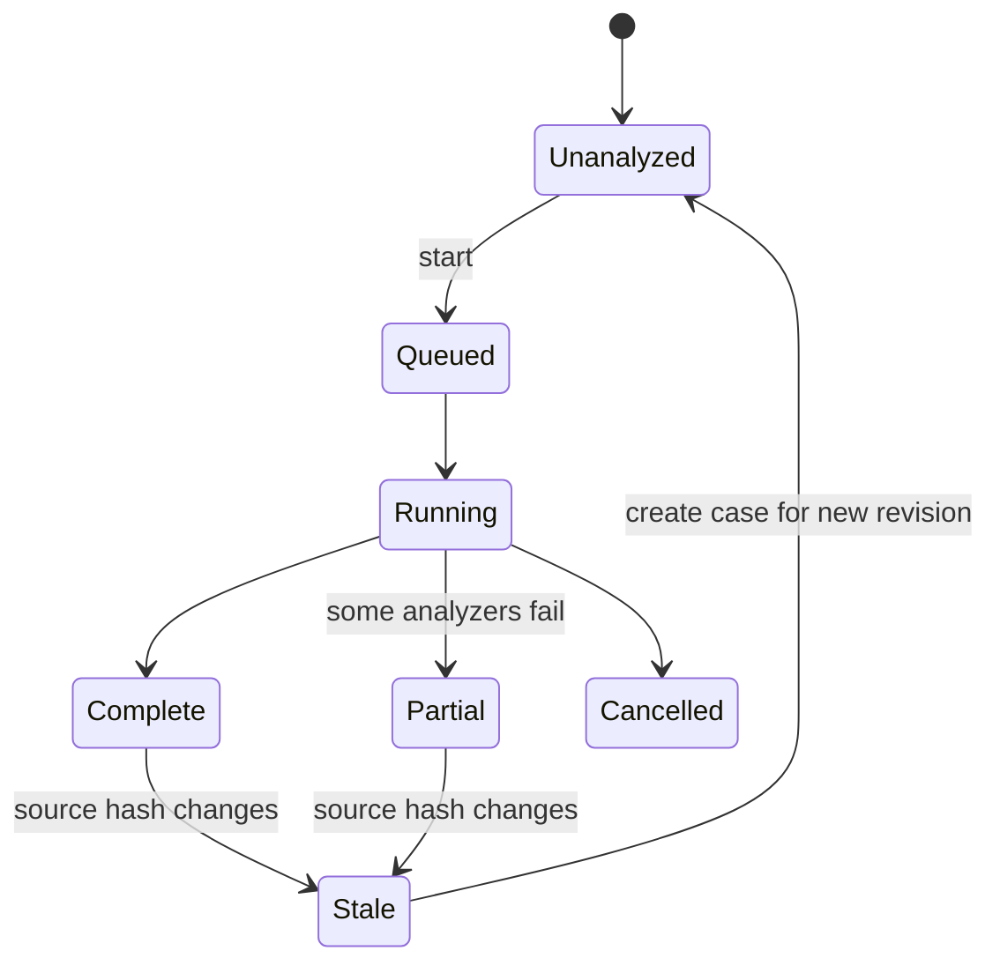

# Version 2.3 — Image Analysis plan

## Goal

Add a dedicated workspace that helps users inspect an image, record reproducible
observations, connect those observations to locations and annotations, and export a clear
report. The workspace has two modes:

- **Pixel Analysis** — pixels, encoding, metadata, provenance, and manipulation indicators.
- **OSINT** — claimed time/place, map context, visible landmarks, measurements, and manual
  reasoning.

These are two views of one `AnalysisCase`, not separate copies of the image or report.

## Trust model

The analysis surface must distinguish:

1. **Fact** — directly read from bytes or a trusted system operation, such as image
   dimensions, source hash, or a valid C2PA manifest.
2. **Derived observation** — deterministic computation, such as a compression residual
   visualization or timestamp disagreement.
3. **Heuristic** — a pattern associated with multiple possible causes.
4. **User assertion** — a note, label, map placement, calibration, or conclusion entered by
   the investigator.
5. **Unavailable/unknown** — evidence not present or not computable.

Confidence attaches only to the narrow observation. A high-confidence observation that a
file contains no EXIF does not imply high confidence that it was AI-generated.

## Workspace lifecycle

### Entry and source choice

- Add **Image Analysis** to the existing layout menu beside Metadata Review.
- Entry requires one selected supported image.
- If multiple images are selected, analyze the last-clicked image and keep the selection;
  a later batch-analysis feature is out of scope.
- Default to original source bytes. When Develop edits exist, offer a labeled
  **Original / Developed** display selector. Findings remain bound to the original unless an
  analyzer explicitly declares that it analyzed the developed rendering.
- Reopen the most recent case for the same source revision.

### Analysis execution

Analyzers are independent and cancellable. The runner should:

- start cheap source and metadata analyzers automatically;
- run pixel-heavy analyzers on demand or at utility priority after the first view is usable;
- publish results incrementally;
- cache results by source SHA-256, analyzer identifier, analyzer version, and parameters;
- invalidate only the analyzer whose version or parameters changed;
- record failure/cancellation as state, not as a finding;
- never block navigation or report access because one optional analyzer failed.

## Evidence and finding model

Each finding needs:

| Field | Purpose |
|---|---|
| Stable ID | Annotation/report references survive reruns where possible |
| Analyzer ID and version | Reproducibility |
| Category | Provenance, metadata, encoding, pixels, time, location, or limitation |
| Severity | Informational, notable, caution |
| Evidence class | Fact, derived, heuristic, user assertion |
| Title | Short, neutral statement |
| Plain-language explanation | What was observed and why it may matter |
| Technical detail | Values, thresholds, and method |
| Alternatives/limitations | Benign explanations and boundaries |
| Confidence | Only for the stated observation |
| Source representation | Original bytes, decoded original, or developed rendering |
| Region references | Optional normalized photo/map annotation IDs |
| Created/computed time | Audit trail |

Findings must not be edited in place by the user. A user can add commentary, include/exclude
the finding from a report, or create a linked user assertion.

## Pixel Analysis

### Source facts

The first panel should be fast and deterministic:

- source filename and canonical URL;
- SHA-256 and byte size;
- file extension, detected container/UTType, and MIME description;
- pixel dimensions, orientation, bit depth, alpha, color profile/CICP where available;
- frame count and animation state;
- HDR/gain-map state;
- embedded thumbnail/preview presence;
- capture, digitization, modification, and file-system timestamps with timezone status;
- camera, lens, exposure, serial, software/creator tool, and GPS values;
- IPTC Digital Source Type;
- C2PA present/valid/trusted/invalid and active manifest summary;
- sidecar presence, relevant modification dates, and whether the displayed rendering includes
  Develop edits.

Raw metadata evidence should retain namespace/key/value and origin (embedded EXIF, TIFF,
IPTC, XMP, sidecar, container, or file system). `TechnicalMetadata` display strings alone
are insufficient for forensic rules.

### Metadata consistency rules

Rules should be data-driven and individually testable. Initial rule set:

| Rule | Output guidance |
|---|---|
| Extension and detected container disagree | Caution; renaming or transport can be benign |
| Camera model but no expected capture time | Notable; metadata may have been stripped |
| Capture time later than file modification time | Caution, accounting for timezone absence |
| GPS present without a GPS timestamp/date | Informational; many cameras/phones omit it |
| Editing software recorded | Informational; editing does not itself imply deceptive manipulation |
| `DigitalSourceType` says AI/composite | Fact; report the declared value |
| C2PA manifest present | Report validity and trust separately |
| Metadata namespaces disagree on the same field | Show every conflicting value and origin |
| PNG with camera-style EXIF or filename | Notable, not suspicious by itself |
| Lossy content in a nominally lossless container | Heuristic only if reliably detectable |
| File has no camera metadata | Informational; messaging apps and publishing systems strip it |
| Dimensions or orientation conflict across container/metadata | Caution |
| Embedded thumbnail materially differs from main image | Caution, with a visual comparison |

The backlog example “real images are rarely PNG” must not become a standalone AI warning.
PNG is common for screenshots, graphics, exports, messaging workflows, and edited photographs.
The useful observation is the combination of container, metadata lineage, pixel structure, and
declared source type.

### Forensic views

The 2.3 baseline should include:

1. **Normal image** — original or explicitly labeled developed representation.
2. **Compression/residual map** — visualizes local reconstruction or frequency differences.
3. **Luminance and channel inspection** — reuse the waveform/parade/vectorscope/chromaticity
   pipelines at a larger size.
4. **Channel view** — R, G, B, alpha, and luminance as selectable monochrome views.
5. **Clipping/out-of-gamut overlay** — reuse existing behavior where methodologically valid.
6. **True-pixel hover loupe** — same source position across the normal and derived views, with
   no interpolation at 100% and a clearly labeled nearest-neighbor magnified view.

Candidate follow-ups, behind separate calibration gates:

- JPEG block-boundary visualization;
- double-compression indicators;
- noise residual and local noise consistency;
- edge/ringing visualization;
- clone/copy-move candidates;
- demosaicing/CFA consistency;
- chromatic aberration or lens-model inconsistency;
- AI-origin model score and region attribution.

Derived images must always carry a visible method label. “Error level analysis” should not be
presented as a manipulation detector; resaving, local detail, gradients, and prior processing
can all affect it. If an ELA-like view is implemented, label it as a compression residual and
document the exact re-encode parameters.

### Bigger scopes and hover detail

Generalize the existing scope presentation:

- resizable scope tiles rather than a fixed 225-point area;
- one, two, or four-up layouts;
- hover cursor linked to the source pixel;
- a local sampling readout with displayed RGB/luminance values;
- region selection to recompute a scope for only the selected rectangle;
- explicit original/developed source label;
- HDR scale and target/display gamut behavior identical to existing scopes;
- cached outputs keyed by source representation, selection region, scale, gamut, and scope type.

Avoid making `ScopeViewModel` own analysis cases. A reusable scope request/result layer should
sit below both the existing sidebar UI and the new analysis UI.

## AI/manipulation analysis

### Required product language

Use:

- “This pattern is sometimes associated with…”
- “The file declares…”
- “The available evidence does not establish…”
- “No indicator was detected by the enabled analyzers.”

Do not use:

- “This image is real.”
- “This image is fake.”
- “AI detected.”
- a green/red authenticity badge derived from unrelated signals.

### Model gate

An AI-origin detector can ship only after:

1. selecting a redistributable on-device model with a compatible license;
2. documenting supported image classes and known failure modes;
3. testing originals, screenshots, scans, social-media recompressions, illustrations,
   composites, and outputs from multiple current generator families;
4. measuring calibration, false-positive rate, false-negative rate, and performance on the
   target Macs;
5. setting a product threshold from the validation corpus rather than intuition;
6. exposing model version and score meaning in the UI/report;
7. confirming that region attribution is technically meaningful rather than decorative.

Until that gate passes, 2.3 can still deliver strong provenance, metadata, compression, scope,
and manual-inspection tools.

## OSINT mode

OSINT is a structured evidence notebook, not an automated geolocation promise.

### Time evidence

Present a timeline of:

- EXIF original/digitized timestamps;
- XMP create/modify/metadata dates;
- IPTC date created;
- C2PA assertion/manifest times;
- file-system creation/modification dates;
- sidecar dates;
- user-entered claimed time and timezone;
- conflicts, missing timezone, and precision.

Never silently normalize a timestamp with no timezone to the Mac’s current timezone. Display
“timezone not recorded” and let the user supply a case-only interpretation.

Conditional later analyzers:

- sun position at a user-supplied location and time;
- shadow-direction comparison;
- weather/history lookup;
- event or map feature search.

These need provider, privacy, licensing, and reproducibility decisions before implementation.

### Location evidence

- Show embedded GPS and its source.
- Allow coordinate paste using the existing parser formats.
- Allow place search and reverse geocoding using established MapKit patterns.
- Let the user distinguish **embedded**, **inferred**, and **user-placed** coordinates.
- Never write an analysis placement back to IPTC GPS without a separate explicit metadata action
  outside the analysis workflow.
- Record map style, center, span/altitude, heading where applicable, and imagery attribution
  in report evidence.

### Satellite companion

The photo and map panels should support:

- satellite and hybrid styles;
- dropping a labeled color marker;
- photo lines, arrows, rectangles, ellipses, and distance measurements, plus geographic map
  markers, lines, polygons, and distances;
- clearly separated Photo and Map tool groups in one fixed OSINT toolbar;
- optional labels on every annotation geometry, with stable links from a map annotation to any
  photo annotation;
- longer case-only notes attached to photo annotations without placing the note text on-canvas;
- independent undo stacks for photo and map markup within one case;
- one-click placement of a selected photo object on the map with its matching color;
- an optional bearing, angle, and range field-of-view cone when setting the photo location;
- a working-folder thumbnail rail and a This Photo / Working Folder map-layer scope;
- side-by-side Photo Annotations and Map Annotations lists with selection and visibility controls;
- capture of the exact map viewport used by the report.

Time evidence and untimed notes share a compact vertical evidence area. A collapsed row exposes its
title and timestamp status; activating it expands provenance, precision, timezone, or note detail.
Untimed observations are stored separately so the UI and report never imply a date that was not
actually established.

Before PDF export with map imagery, verify the provider’s snapshot/export terms and required
attribution. If redistributable imagery cannot be guaranteed, the report should include a
schematic map/coordinates and an attribution-compliant reference instead of embedding a
satellite screenshot.

## Markup and measurement

### Tools

| Tool | Required behavior |
|---|---|
| Select | Move, resize, relabel, recolor, reorder, hide, delete |
| Line/arrow | Optional end caps and label |
| Distance | Two points, pixel length, optional calibrated unit |
| Rectangle | Outline/fill opacity and label |
| Ellipse | Outline/fill opacity and label |
| Text label | Short evidence label, color, leader line |
| Map marker | Coordinate, label, color, embedded/inferred/user source |

Use a small fixed, color-blind-considered palette plus a custom color picker. Color is
supplemental: labels also need text/number IDs so matching objects do not depend on color alone.

### Coordinate rules

- Photo annotations are stored in normalized, display-oriented full-image coordinates.
- Each annotation also records the orientation and source pixel size at creation for audit and
  migration.
- View crop/zoom does not alter stored geometry.
- A report can render annotations against the original or developed representation only when
  their transform relationship is known.
- Map geometry uses geographic coordinates, not screenshot pixels.
- Report snapshots resolve those coordinates into the chosen viewport at export time.

### Measurement

- Default unit is source pixels.
- Displayed screen points are never reported as source pixels.
- Optional calibration is user-authored: draw a reference segment and enter its known length
  and unit.
- Store the calibration segment, entered value, unit, and user note.
- Derived distances show sensible precision and “calibrated by user.”
- DPI/PPI metadata can be displayed but cannot establish physical object size in a scene.

Perspective-aware measurement is out of scope for 2.3 unless a separate homography calibration
design is approved.

## Analysis report PDF

### Report structure

1. **Cover/summary**
   - case title and ID;
   - source filename, hash, byte size, and analysis time;
   - app version and report schema version;
   - analyst-entered purpose/summary;
   - prominent limitations statement.
2. **Source and provenance**
   - source facts;
   - C2PA validation/trust details;
   - declared digital source type;
   - original/developed distinction.
3. **Automated findings**
   - included findings grouped by category;
   - plain-language explanation, technical details, alternatives, analyzer version.
4. **Pixel evidence**
   - normal reference image;
   - selected derived views;
   - annotated evidence crops with scale and interpolation labels.
5. **Time and location**
   - timestamp table/timeline;
   - coordinates and map evidence;
   - imagery attribution and retrieval/export time.
6. **User observations**
   - annotations, measurements, calibration, and notes.
7. **Methodology and limitations**
   - analyzers run, skipped, failed, and their versions/parameters;
   - known limitations;
   - source-change status.
8. **Appendix**
   - raw relevant metadata conflicts;
   - full source hash;
   - case/report identifiers.

### Export rules

- Generate from an immutable report snapshot so edits during export cannot mix states.
- Recompute and compare source SHA-256 immediately before snapshot creation.
- Page-break findings and figures deliberately; never crop captions or annotation legends.
- Downsample overview figures, but preserve true-pixel evidence crops.
- Embed fonts or use system-safe PDF fonts consistently.
- Add PDF title/author/subject metadata and tagged accessibility if the chosen API supports it.
- Write atomically and keep the case unchanged if export fails.
- Do not claim cryptographic report signing unless a separate signing design is completed.

## Performance budgets

Initial budgets to validate during F0:

| Operation | Target |
|---|---|
| Workspace first usable frame | under 500 ms after cached preview is available |
| Source facts for common JPEG/HEIC | under 1 s |
| Cancel reaction | under 250 ms between analyzer checkpoints |
| Scope/derived view interaction | 30 fps minimum while panning on target hardware |
| Hover sample response | under 50 ms from cached texture/data |
| Analysis cache memory | bounded and cost-evicting |
| Report export | progress shown after 500 ms; cancellable between pages/figures |

Large RAW decode and full-file SHA-256 may exceed the targets. Show separate progress and avoid
double-reading the file when hashing and metadata parsing can safely share a stream.

## Test plan

### Fixtures

Create a redistributable fixture corpus containing:

- camera JPEG, HEIC, and RAW+XMP;
- scanned film/print;
- PNG screenshot and exported photographic PNG;
- images with stripped, conflicting, malformed, and non-ASCII metadata;
- C2PA trusted, valid-untrusted, invalid, and absent;
- rotated/mirrored images for all EXIF orientations;
- SDR, HDR, gain-map, alpha, animated, and multi-frame sources;
- single- and double-compressed JPEG samples with known creation steps;
- benign edited/composited images;
- licensed AI-generated examples from multiple tools, if a model gate is attempted.

Each fixture needs a provenance README and generation recipe where possible.

### Automated tests

- rule evaluation from synthetic raw metadata records;
- analyzer cache key/version invalidation;
- cancellation and partial-result behavior;
- source-hash change and stale-case handling;
- annotation Codable/migrations and normalized transform round-trips;
- all EXIF orientation transforms;
- calibrated measurement math and unit conversion;
- map geographic geometry serialization;
- deterministic report snapshot ordering;
- PDF page count, required text, source hash, image presence, and attribution;
- malformed/corrupt case recovery;
- no source or metadata write during analysis.

### Manual validation

- true-pixel readouts against known pixel fixtures;
- derived-view alignment at fit, 100%, and maximum zoom;
- HDR/SDR presentation;
- map labels paired with photo labels;
- report visual QA at A4 and US Letter printing;
- VoiceOver reading order and keyboard-only annotation;
- source moved, renamed, changed, offline, read-only, and on iCloud;
- memory pressure during a large RAW analysis;
- sleep/wake and app quit during running analyzers.
