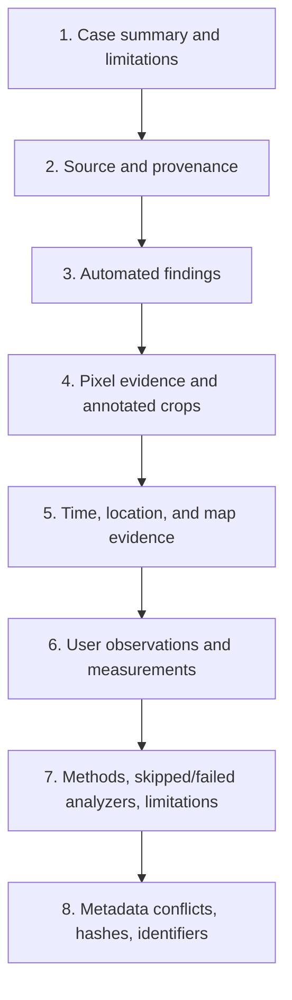

# Version 2.3 — low-fidelity wireframes

These diagrams describe information hierarchy and interaction, not final visual styling.

## Image Analysis — Pixel Analysis

```text
┌────────────────────────────────────────────────────────────────────────────────────────────┐
│ Image Analysis   [Pixel Analysis | OSINT]   Original ▾   Run analyzers   Export report…    │
├───────────────────┬──────────────────────────────────────────────────────┬─────────────────┤
│ CASE / FINDINGS   │ VIEW                                                 │ DETAILS         │
│                   │                                                      │                 │
│ Source ✓          │  [Normal | Residual | R | G | B | Luma]             │ Finding title   │
│ Provenance 2      │  ┌────────────────────────────────────────────────┐  │ Observation     │
│ Metadata 4        │  │                                                │  │ Why it matters  │
│ Encoding 1        │  │        image + linked hover / markup           │  │ Alternatives    │
│ Pixels 3          │  │                                                │  │ Technical data  │
│ Limitations 2     │  └────────────────────────────────────────────────┘  │ Confidence      │
│                   │                                                      │ Include report ☑│
│ + User note       │  ┌──────────────────────┬─────────────────────────┐  │ Link annotation │
│                   │  │ Large scope          │ Hover true-pixel detail │  │                 │
│ Source hash…      │  └──────────────────────┴─────────────────────────┘  │                 │
└───────────────────┴──────────────────────────────────────────────────────┴─────────────────┘
```

Behavior:

- left selection chooses a finding but does not hide the broader evidence list;
- center tools affect the visible representation and annotation layer;
- right side always shows evidence class and limitations;
- source-change, analyzer failure, and report snapshot states appear as banners above the view.

## Image Analysis — OSINT

```text
┌────────────────────────────────────────────────────────────────────────────────────────────┐
│ Image Analysis   [Pixel Analysis | OSINT]   Claimed time…   Place search…   Export report… │
├────────────────────────────────────────────┬───────────────────────────────────────────────┤
│ PHOTO                                      │ SATELLITE / HYBRID MAP                        │
│ ┌────────────────────────────────────────┐ │ ┌───────────────────────────────────────────┐ │
│ │ [1 red] roof corner                    │ │ │ [1 red] candidate building corner         │ │
│ │      ↘                                 │ │ │                           ↙               │ │
│ │       annotated photograph             │ │ │                satellite imagery          │ │
│ │                                        │ │ │                                           │ │
│ └────────────────────────────────────────┘ │ └───────────────────────────────────────────┘ │
│ Select Line Measure Rect Ellipse Label     │ Marker Line Measure Shape Label  Attribution │
├────────────────────────────────────────────┴───────────────────────────────────────────────┤
│ TIME / LOCATION EVIDENCE                                                                  │
│ EXIF Original  14:32  timezone not recorded   •   C2PA 14:35Z   •   User claim 15:32+01   │
│ Embedded GPS: none   •   User-placed candidate: 59.9139, 10.7522   •   Notes…             │
└────────────────────────────────────────────────────────────────────────────────────────────┘
```

The paired label ID and text—not color alone—connect photo and map objects.

## Comparison

```text
┌────────────────────────────────────────────────────────────────────────────────────────────┐
│ Compare   Side by Side ▾   🔒 Locked   Align…   Reset   Fit ▾   100%   Clean Feed ▾       │
├──────────────────────────────────────────────┬─────────────────────────────────────────────┤
│ A • Focused                                  │ B                                           │
│ IMG_0001.CR3 • Live Edit • HDR               │ IMG_0002.CR3 • Committed Edit • SDR         │
│                                              │                                             │
│              image A                         │                image B                      │
│                                              │                                             │
│         same normalized center               │        same center + saved offset           │
│                                              │                                             │
├──────────────────────────────────────────────┴─────────────────────────────────────────────┤
│ 235% • nearest-neighbor • alignment offset active • B clamped at right edge                │
└────────────────────────────────────────────────────────────────────────────────────────────┘
```

The focused pane has a non-color-only border/title affordance. A clamp/alignment message is
visible rather than allowing imperfect sync to look like a bug.

## Develop version selector

```text
┌────────────────────────────────────────────────────────────────────┐
│ Develop   Version: Warm editorial ✓ ▾      Compare Version…       │
│                                                                    │
│  Primary (XMP)                                                     │
│  ────────────────────────────────────────────────────────────────  │
│  Warm editorial             Saved        Global • Crop • 2 masks  │
│  Neutral wire               Saved        Global • 1 mask           │
│  High-contrast experiment   Missing LUT  Global • LUT • Crop       │
│                                                                    │
│  + New Version from Current                                       │
│  Duplicate   Rename   Delete   Set Default   Promote to Primary…   │
└────────────────────────────────────────────────────────────────────┘
```

Promotion uses a confirmation sheet:

```text
┌────────────────────────────────────────────────────────────────────┐
│ Promote “Warm editorial” to Primary?                              │
│                                                                    │
│ This will replace the current XMP-backed Develop state. A recovery │
│ version of the current Primary will be kept.                       │
│                                                                    │
│ Current Primary: Global • Crop                                    │
│ New Primary:     Global • Crop • 2 masks                          │
│ Sidecar:         IMG_0001.xmp                                     │
│                                                                    │
│                              Cancel   Promote and Verify            │
└────────────────────────────────────────────────────────────────────┘
```

## Report page hierarchy



Every figure caption states:

- original or developed representation;
- overview or true-pixel crop;
- derived-view method and parameters;
- annotation IDs shown;
- map attribution where applicable.
